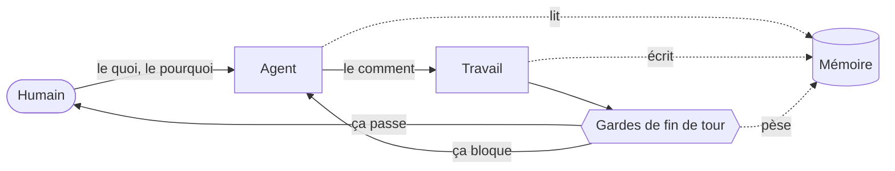
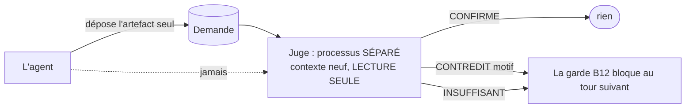
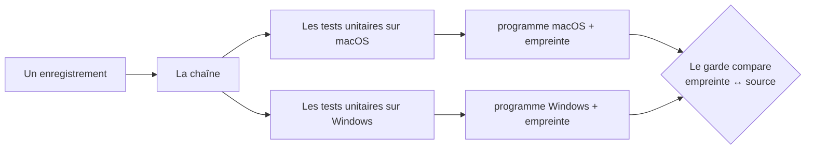

# Le harnais — comment ça marche

> Pour quelqu'un qui n'a jamais vu ni « boucle agentique » ni « harnais ».
> Les comportements Copilot cités ici viennent de la documentation officielle
> ou du CLI 1.0.90-0 ; l'activation effective reste à mesurer sur chaque projet.

---

## 1. Le problème, avant la solution

Un agent de code, c'est un modèle de langage à qui on donne un dossier, des
outils (lire, écrire, exécuter) et un but. Il travaille seul, parfois des
heures.

Trois choses tournent mal, toujours les mêmes :

| | ce qui se passe |
|---|---|
| **Il oublie** | chaque session repart de zéro. Ce qu'il a appris hier n'existe plus. |
| **Il affirme** | il annonce « c'est fait, tout marche » sans avoir vérifié — et personne ne le reprend. |
| **Il garde ses questions** | il bute sur une décision qui appartient à l'humain, et l'enterre dans un paragraphe que personne ne lit. |

La réponse habituelle est de **le lui demander** : « pense à vérifier », « pense
à noter ». Ça ne tient pas. Une consigne dans un prompt ne constitue pas une garde exécutable.

**Le harnais est la réponse inverse : ne rien demander au modèle, et brancher
des déclencheurs que la machine exécute, qu'il le veuille ou non.**

---

## 2. L'idée en une image



Trois boucles imbriquées :

1. **La boucle courte** — l'agent travaille, les gardes l'arrêtent s'il s'apprête
   à rendre la main dans un mauvais état. Il repart, corrige, revient.
2. **La boucle de mémoire** — ce qu'il lit est noté ; ce qu'il apprend est écrit ;
   ce qui n'a jamais servi s'endort.
3. **La boucle humaine** — ce qui demande une décision remonte, en question
   fermée, sur le téléphone du commanditaire.

---

## 3. Ce qu'on installe

Le paquet, pour GitHub Copilot CLI seulement, fournit `hooks/copilot.json`, `skills/` et le binaire `bin/harnais`.

```powershell
copilot plugin marketplace add "C:\Outils\copilot-harness"
copilot plugin install harnais@atelier-copilot
harnais adopte         # à blanc
harnais adopte --go    # pose la mémoire et déclare le plugin
```

La marketplace locale charge le code **en direct** : `/restart` ou une nouvelle
session prend la correction sans `copilot plugin update`. Le paquet est déclaré
par `enabledPlugins` et résolu par `extraKnownMarketplaces` (marketplace connue)
ou `~/.copilot/installed-plugins/`. `~/.copilot/plugin-data/atelier-copilot/harnais`
garde l'état hors du code. Le harnais lit `COPILOT_PLUGIN_ROOT`,
`COPILOT_PLUGIN_DATA` et `COPILOT_PROJECT_DIR` (noms lus dans le CLI 1.0.90-0,
qui pose aussi `PLUGIN_ROOT` et `PLUGIN_DATA`) ; à défaut, le lanceur retrouve
le paquet et l'état par leurs chemins sous `~/.copilot/`.

**Limite de la forme multi-agents :** `.github/copilot/settings.json` est lu à
la racine du dépôt git, **pas depuis le dossier courant**. Les déclarations
`agents/<nom>/.github/copilot/settings.json` d'un dépôt commun ne chargent
pas chacune le plugin ; les hooks qu'il porte n'y partent donc pas grâce à
ces fichiers. Un plugin activé à la racine est actif pour le dépôt entier,
non agent par agent. Vérifier dans chaque session le briefing et le refus de la
garde ; ne pas remplacer la mesure par le contenu de la déclaration.

Copilot lit aussi les fichiers d'un autre assistant : `CLAUDE.md`,
`.claude/CLAUDE.md`, `.claude/skills/` et `.claude/settings(.local).json`
(relevé dans le CLI 1.0.90-0). Le harnais n'y écrit jamais ; si un ancien
paquet `harnais@atelier` est déclaré dans `.claude/settings.json`, il signale
le risque de double chargement.

---

## 4. Les déclencheurs Copilot

| Événement | Harnais | Sortie décisive |
|---|---|---|
| `sessionStart` / `SessionStart` | briefing d'entrée | `additionalContext` |
| `userPromptTransformed` | traitement du contenu remis au modèle | `modifiedTransformedPrompt` si nécessaire |
| `preToolUse` / `PreToolUse` | garde de commit et périmètre d'écriture `Edit|Write` | `permissionDecision: "deny"` + raison |
| `postToolUse` / `PostToolUse` | journal des commits réussis | résultat / contexte |
| `agentStop` / `Stop` | quatorze gardes de fin de tour | `{"decision":"block","reason":"…"}` |

Les noms PascalCase reçoivent des champs d'entrée `snake_case` ; les noms camelCase utilisent des champs `camelCase`.
`userPromptSubmitted` ne permet pas à un hook de commande de modifier le
message : seul `userPromptTransformed` accepte la transformation effective.
Un `PreToolUse` à matcher `Edit|Write` voit `edit`/`create`, pas les écritures
passant par un shell. C'est une limite de la garde, pas une isolation globale.
Le hook `preToolUse` commande refuse une erreur de commande, mais **son timeout
laisse passer** : ne pas promettre le fail-closed dans ce cas.

`agentStop` peut demander de continuer, mais Copilot **termine après huit
blocages consécutifs**, même si le hook persiste. La signature de l'état évite
de répéter un blocage identique ; une garde ne garantit pas un blocage sans
limite. Aucun hook d'usage de mémoire auto fichier n'est conservé.

Une déclaration ne prouve pas l'exécution. Vérifier le briefing, le refus de
la garde et la trace de version avant d'annoncer qu'un agent est servi.

Le briefing identique est dédupliqué entre `SessionStart` et
`userPromptTransformed` par **identifiant de session et dossier de lancement**.
Les faits, l'état, les tâches, les périmètres et le carnet sont comparés par
leur contenu : un changement réinjecte le contexte au prompt suivant.
Sans identifiant fourni par l'hôte, aucune session n'est assimilée à une autre :
la déduplication n'est alors pas garantie.

---

## 5. Les quatorze gardes de fin de tour

C'est le cœur. Au moment où l'agent s'apprête à rendre la main, quatorze questions
sont posées à l'état du projet. Chacune peut le renvoyer travailler.

| | Ce qu'elle refuse |
|---|---|
| **B1** | du code a bougé et le fichier de tâches n'a pas suivi |
| **B2** | l'humain a répondu à une question et la réponse n'a pas été traitée |
| **B3** | une décision a été tranchée et rien n'en a été fait |
| **B4** | une demande de l'humain n'a pas été prise en compte |
| **B5** | un chantier partagé fini sans une ligne au carnet d'équipe |
| **B6** | un fichier de faits touché sans l'autorisation explicite du commanditaire |
| **B7** | un constat posé sans de quoi le **rejouer** plus tard |
| **B8** | une question mal formée : pas fermée, sans dire ce que chaque réponse déclenche |
| **B9** | une vérification qui est **tombée** et qu'on s'apprêtait à ignorer |
| **B10** | une liste de contrôle des rechutes non rejouée avant d'affirmer |
| **B11** | de l'acharnement : trois fois la même approche sans changer de méthode |
| **B12** | un relecteur indépendant a **contredit** une affirmation qui part vers l'humain |
| **B13** | une question **nouvelle** pour l'humain est rangée dans la liste sans être posée dans le message de fin de tour |
| **B14** | sur un projet réglé sur Notion (`HARNAIS_CANAL=notion`) : une question pour l'humain sans le lien de sa ligne dans la base Décisions — et plus rien ne part vers les Rappels |

### La garde B7, pour comprendre l'esprit

Une **tâche** (« construire X ») reste vraie jusqu'à ce qu'on la fasse. Un
**constat** (« X manque ») peut cesser d'être vrai **tout seul**, sans que
personne y touche. Et un constat bien mesuré n'est pas plus durable qu'un
constat bâclé : seulement plus crédible, donc **plus dangereux quand il périme**.

La garde exige donc, sous chaque constat, de quoi le rejouer :

```
- [ ] !haut @user ?constat  **J'ouvre une page de contact ? oui / non**
      oui → tes clients peuvent t'écrire ; 1 h de travail, en ligne demain.
      non → ils n'ont que le téléphone ; on ferme le sujet.
      ↻ service :: curl -s -o /dev/null -w '%{http_code}' https://x/contact :: ^404$
```

La dernière ligne est rejouée **au moment où la question part vers l'humain**,
et elle a trois issues : **TIENT** · **TOMBÉ** (la question disparaît de sa
liste) · **MUET** (la vérification n'a pas abouti). *Un contrôle qui échoue ne se
lit jamais comme un constat confirmé.*

---

## 6. La mémoire — trois maisons et un journal

| Dossier | Nature | Plafond |
|---|---|---|
| `brain/fact/` | faits communs du projet | 4 fichiers, 5 en équipe (`roles.md`) |
| `brain/mind/` | état d'un agent : `state.md`, `todo.md` | 2 fichiers par agent |
| `docs/` | décisions et traces datées | aucun |
| `.logs/` | journal de commits append-only | aucun |

`cap:` est dans `brain/fact/base.md`. L'en-tête de `state.md` exige `maj`,
`sante`, `jalon` ; les tâches de `todo.md` sont lues **dans tout le fichier**
avec `[ ]`, `[>]`, `[~]`, `[x]`, `!haut`/`!moyen`/`!bas` et `@<qui>`.
Ne jamais compresser `todo.md` ou `.logs/` : le programme relit les marqueurs.
L'ancien rangement `.fact/`/`.mind/` reste lisible ; `brain-migre` le déplace
sur décision. Un projet qui porte les deux formes ne reçoit aucune mémoire.

Sous Copilot, chaque worktree résout la mémoire de **son propre checkout**,
pas celle du dépôt principal. Un worktree sans `brain/` reste sans mémoire,
même si le principal en possède une. Le carnet est également local au worktree ;
partager des changements se fait par Git, pas par une écriture invisible dans
le checkout d'un autre agent.

L'app Copilot ouvre chaque session dans une telle copie, rangée sous
`~/.copilot/repos/copilot-worktrees/` : les dossiers voisins de l'agent ne
sont alors pas l'atelier. Le briefing le dit (ligne `lieu`), avec la branche et
le dépôt principal, et `atelier-monte` écrit dans le rôle du CTO le chemin
absolu de l'atelier et celui du paquet, pour qu'aucun chemin ne soit déduit du
dossier courant. Quand le terminal de la session ne trouve pas `harnais`, le
briefing donne son chemin complet (ligne `commande`) ; l'installateur ajoute
`bin/` au PATH de l'utilisateur pour que ce cas reste l'exception.

Copilot n'a pas de mémoire de notes locale indexée par chemin. Les constats durables
vont dans `brain/` ou `docs/`, les leçons transversales dans la méthode après
validation. `~/.copilot/session-state/` conserve les sessions, pas une quatrième
maison de notes. Son comportement après renommage de dossier : **non mesuré**.

**Copilot Memory est coupé.** Copilot retient de lui-même des faits de dépôt et
des préférences, chez GitHub, que rien ne confronte à `brain/fact/`. Relevé dans
le CLI 1.0.90-0 : le réglage est `memory` dans
`~/.copilot/settings.json`, **actif quand il est absent**, écrit par
`/memory on|off`. L'installateur pose `"memory": false` (sauf
`-KeepCopilotMemory`), note la valeur d'avant au journal et la rend à la
désinstallation si personne n'y a touché entre-temps ; une mise à jour respecte
une mémoire rallumée par l'utilisateur. Le briefing relit le réglage à chaque
session et signale une mémoire active, absente ou illisible. Que ce réglage soit
aussi accepté dans `.github/copilot/settings.json` d'un dépôt : **non mesuré**.

Les sections de faits indiquent comment elles ont été établies, sur la ligne
sous leur titre : `> **mesuré** · 01/10/2026 — la façon de rejouer la mesure`.
Le niveau (`mesuré`, `observé`, `supposé`, `dit`) fixe d'où part la confiance ;
une nature facultative après la date (`· croyance`, `· expérience`, `· fait`)
fixe la vitesse de vieillissement : 4 semaines pour un fait, 2 pour une croyance
— une supposition l'est d'office —, 6 pour une expérience. Le briefing applique
cette péremption ; la confiance chiffrée qui bouge avec les résultats ne
s'applique pas encore à `brain/fact/`. Sans lien rejouable, un niveau n'est
qu'un mot.

---

## 8. Le relecteur — celui qui n'a pas écrit ce qu'il relit

Le problème est ancien : **celui qui écrit ne peut pas être celui qui juge.**
Un même contexte qui se relit lui-même n'est pas une relecture, c'est un biais de
confirmation avec une commande.

En équipe, on sépare les rôles par **agent**. Seul, on les sépare par
**contexte** :



Ce que le juge reçoit : **l'affirmation, ce qui l'accompagne, et de quoi la
vérifier.** Jamais le raisonnement qui y a mené, jamais la conversation.
**Il ne peut pas confirmer ce qu'il n'a pas vu** — c'est l'équivalent d'une
permission refusée, obtenu autrement.

Quatre règles qui ne sont pas décoratives :

1. **Le juge est indépendant** — un processus séparé, en lecture seule : ni
   écriture, ni suppression, ni enregistrement. Un juge qui pourrait réparer ce
   qu'il reproche n'est plus un juge.
2. **Son verdict est un jeu fermé** — `CONFIRME` · `CONTREDIT <motif>` ·
   `INSUFFISANT <ce qui manque>`. Jamais de prose.
3. **L'agent ne peut pas modifier ses critères** — ils vivent dans un fichier
   livré avec le paquet ; les changer laisse une trace dans l'historique.
4. **Un juge muet, coupé ou bavard n'est JAMAIS un accord.** Tout ce qui n'entre
   pas dans le jeu fermé devient « insuffisant ».

Et une porte laissée ouverte : le juge n'a pas raison d'office. Le message de
blocage propose trois issues — *il a raison* · *la mesure est fausse* · *il a
tort et je peux le montrer* — et n'interdit que la quatrième : **passer outre
sans rien écrire.**

---

## 9. Deux formes : un agent, ou une équipe

En mono : `brain/fact/`, `brain/mind/` et le `AGENTS.md` du projet à la racine
git. En multi : `brain/fact/` partagé, `brain/mind/<nom>/` pour chacun, et
`agents/<nom>/AGENTS.md` pour son rôle. Le `AGENTS.md` de la racine git est lu
aussi par chaque agent, car c'est un dossier intermédiaire jusqu'à son `cwd`.
`brain/fact/roles.md` nomme les zones partagées et les frontières.

`harnais equipe` pose le périmètre de chaque agent dans le dossier de
lancement ; la garde `PreToolUse` du plugin en est le lecteur. Copilot ignore
`permissions.deny` hors réglages managés. La forme multi-agents écrit aussi les réglages
dans chaque dossier de lancement ; dans un dépôt git commun, **Copilot ne les
lit pas**. Ni le paquet ni ses hooks ne sont activés indépendamment par cette
forme. Si le plugin est activé à la racine, ses hooks sont communs au dépôt ;
la garde peut encore lire le périmètre de l'agent courant, à vérifier par un
essai effectif. Sans plugin chargé, il n'y a aucune garde.

Copilot lit `AGENTS.md` et `CLAUDE.md` sans ordre de priorité général : signaler
un doublon et ne pas laisser des contenus divergents. Copilot ne remonte pas
au-dessus de la racine Git pour trouver la méthode. `adopte` ajoute une copie
dans `.github/copilot-instructions.md`, en conservant le contenu existant.
Ce branchement est indépendant de `COPILOT_CUSTOM_INSTRUCTIONS_DIRS` :
le CLI SDK 1.0.90-0 mesuré ne chargeait pas le répertoire supplémentaire.
La variable reste utile aux hôtes qui la prennent en charge, sans être une
preuve de chargement. Un bloc de méthode déjà présent est conservé ; sa
mise à jour doit être réconciliée explicitement avec les règles du projet.

---

## 10. Comment on sait que ça marche

### Accueil du CTO et profils

Le parcours court est dans le README : créer `Agentic\CTO`, coller le prompt
d'installation, lire la prévisualisation et autoriser explicitement `-Go`,
puis redémarrer. La session d'installation ne crée pas les agents projet.

L'accueil est placé dans le **modèle de rôle CTO**, pas dans la méthode
commune : les agents projet ne doivent pas accueillir un premier projet.
Le **briefing** rappelle ce parcours quand le registre versionné
`docs/projects.json` du CTO existe et contient `{"schema":1,"projects":[]}`.
Il ne déduit pas une déclaration de la présence d'un dossier voisin.
Le mécanisme de déduplication évite deux injections identiques dans une
session ; une nouvelle session reçoit encore l'accueil tant que le registre
est vide. Après une adoption réussie, une entrée valide contient `name`,
`path` et une liste `profiles` parmi OPS/PO/QA : l'accueil s'arrête.

Pendant l'accueil, les gardes de **forme** de fin de tour (B8 forme des
questions, B10 relecture des rechutes, B13 questions à poser) et le dépôt au
relecteur se taisent : les questions de cadrage (« nouveau ou existant ? »)
n'ont ni conséquences chiffrées ni critère « fini quand ». Les gardes d'état
restent armées.

Le projet agentique se crée sous la racine de l'atelier, avec son propre dépôt.
Un code qui existe ailleurs y reste : `harnais adopte --code "<chemin>"` en
inscrit l'adresse dans `brain/fact/architecture.md`, sans rien écrire dans le
dossier du code.
Un registre invalide produit une erreur explicite.

Le CTO termine sa mémoire, demande nouveau/existant et emplacement, présente
les trois profils, propose nom/périmètre/règles/ton, puis fait approuver les
écritures. Les fiches `skills/agentic-agents/references/profiles/` renvoient à
`roles.md` sans remplacer cette référence. Un seul profil reste mono-agent ;
plusieurs profils n'ont de sens qu'avec des responsabilités disjointes.
QA reste en lecture seule, sans prétendre que la garde Edit/Write bloque
les écritures shell.

Le registre et les instructions doivent être commités pour les nouvelles
sessions en worktree. Les ateliers existants conservent leur `AGENTS.md` :
la mise à jour du paquet n'actualise pas automatiquement un rôle personnalisé.
Il faut y intégrer ce nouveau parcours après accord.

C'est la partie qu'on oublie le plus souvent, et c'est celle qui décide.

### Le contrôle différentiel avec témoin

Quand un composant est réécrit, on fait tourner l'ancienne et la nouvelle
implémentation sur les **mêmes** entrées et on compare : code de sortie, message
**caractère par caractère**, appels extérieurs, et chaque fichier d'état
**octet par octet**.

> **Chaque contrôle porte son témoin.** Deux programmes qui ne font rien
> comparent égal. Un banc sans contrôle négatif ne se distingue pas d'un banc
> qui regarde ailleurs.

### On compte les chemins TRAVERSÉS, pas les cas joués

Une comparaison peut rendre « aucun écart » sur de nombreux cas sans avoir atteint
toutes les sorties bloquantes : celles qui vivent derrière une barrière
qu'aucun cas ne franchit restent non vérifiées. Le silence se lit comme une
confirmation.

**Une suite de contrôles doit énumérer les chemins qu'elle traverse, et se
déclarer ratée si l'un manque.**

### La passe mécanique — six questions qu'aucun juge ne peut poser

| | |
|---|---|
| ① | les contrôles passent-ils **depuis un dossier vide** ? |
| ② | les programmes livrés viennent-ils **du même état du code** ? |
| ③ | ce qui a été ajouté **a-t-il un appelant** ? |
| ④ | une déclaration qui ne trouve pas son programme **le dit-elle**, et le garde de commit **refuse-t-il** ? |
| ⑤ | chaque **voie du code** a-t-elle une **déclaration** qui l'alimente ? |
| ⑥ | le **paquet installé** correspond-il au dépôt, version **et** contenu ? |

### La chaîne de construction

Les programmes ne sont **jamais** compilés à la main sur une machine de travail.
Une chaîne d'intégration les produit à partir d'un état du code identifié, et
**chaque programme porte l'empreinte du code qui l'a produit**.



C'est le remède au défaut qu'un programme compilé apporte : un interpréteur
manquant se voit tout de suite, **un programme périmé par rapport à son source ne
se voit jamais**.

---

## 11. Pas de repli — et ça s'annonce

Chaque déclencheur passe par un lanceur d'une ligne, qui ne teste pas « le
programme existe » mais **« il répond »** — un programme compilé pour une autre
plateforme est bien présent, exécutable, et incapable de démarrer.

S'il ne répond pas, il n'y a **pas de repli** : le paquet ne livre plus
d'implémentation interprétée. Un repli est conçu pour être invisible — c'est sa
qualité quand il est équivalent, et son piège quand il ne l'est pas : une
machine qui y tombe reçoit un harnais dégradé **et lui fait la confiance de
l'original**.

Le lanceur fait donc l'inverse, à chaque déclencheur : **il le dit**, avec le
remède — mettre le paquet à jour, ou constater que cette machine n'est pas
couverte (le paquet livre macOS Apple Silicon et Windows x86_64). Et le garde de
commit, lui, **refuse** la commande plutôt que de la laisser passer sans
contrôle.

---

## 11 bis. Windows : vérifier le lanceur réel

Copilot accepte des entrées `bash` (macOS/Linux) et `powershell` (Windows)
dans ses hooks. Une commande POSIX seule sur Windows ne prouve donc rien sur le
hook Copilot : vérifier `hooks/copilot.json`, lancer une session Windows et
observer la trace de briefing et le résultat de la garde. Sans cette mesure,
le comportement sur un poste neuf est **non mesuré**.

---

## 11 ter. Le silence n'a pas de sens par défaut

Deux conclusions fausses guettent, et **les deux pour la même raison** : le
harnais ne fait aucun bruit quand il autorise.

- Un module peut rendre « rien » sur un projet parfaitement en forme. C'est le
  comportement juste — il ne répond que dans un cas particulier — mais un
  « rien » qui veut dire *tout va bien* et un « rien » qui veut dire *je n'ai
  pas trouvé* sont **indiscernables** dans une sortie muette.
- Une garde peut laisser passer des enregistrements d'affilée sans être
  inerte : sa condition n'est pas réunie. Rien ne le dit.

**Un silence ne prouve rien, dans les deux sens.** D'où la sous-commande de
diagnostic, et sa règle : chaque ligne dit ce qui a été **cherché**, ce qui a
été **trouvé**, et quand rien ne l'a été, **pourquoi**. Jamais un blanc.

Corollaire pratique : **pour vérifier une installation, il faut un projet qui a
de la matière.** Sur un dossier vide, tout sort en 0 sans écrire une ligne, et
la mesure ne mesure rien.

## 12. Ce que ça ne fait pas

Dire ce qu'un système ne couvre pas vaut mieux que de le laisser découvrir.

- **Ça ne remplace pas la décision humaine.** Le harnais fait remonter, il ne
  tranche pas. Un agent ne peut jamais en **autoriser** un autre.
- **Ça ne juge pas la qualité du code.** Les gardes portent sur la forme du
  travail et sur ce qui part vers l'humain, pas sur l'architecture.
- **Ça ne rattrape pas un mauvais découpage des rôles.** Un projet mal découpé
  produit trois agents qui se marchent dessus, harnais ou pas.
- **Le canal vers le téléphone est propre à une plateforme.** Ailleurs, la
  capacité est absente — et le harnais **le dit** plutôt que de se taire.

---

## 13. Les cinq idées à retenir

1. **Mesurer ce qui tourne.** Un déclencheur déclaré mais non chargé ne fait
   rien ; un hook bloquant peut expirer ou atteindre sa limite de huit tours.
2. **Ne rien voir n'est pas un succès.** Tout compte rendu distingue trois
   états : vérifié bon · vérifié mauvais · **pas mesuré**.
3. **Un mécanisme sans appelant se lit comme présent.** Chercher qui déclenche,
   pas seulement ce qui est écrit.
4. **Celui qui écrit ne peut pas être celui qui juge.** À défaut d'un second
   agent, séparer par le contexte : donner l'artefact, et rien du raisonnement.
5. **Une trace datée a le droit d'être dépassée.** Ce qui est vivant se juge sur
   l'état du jour ; ce qui est figé, sur l'état de son propre moment. Confondre
   les deux transforme chaque correction en faute.
